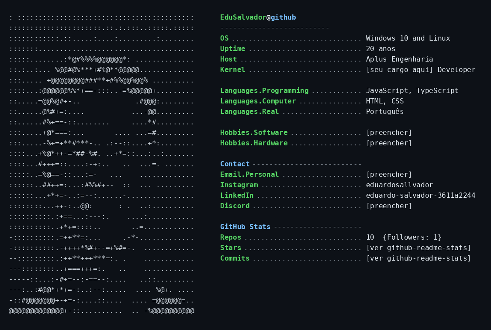

# EduSalvador / README.md

<!--
COMO PUBLICAR ESSA VERSÃO (com imagem colorida)
================================================
Diferente da versão em texto puro, essa aqui usa uma IMAGEM (readme_card.png),
então são 2 arquivos que precisam ir pro mesmo repositório:

1. No repositório EduSalvador/EduSalvador (o mesmo de sempre), clique em
   "Add file" > "Upload files".
2. Suba os DOIS arquivos juntos: este README.md E o readme_card.png.
3. Confirme que o README.md faz referência a "./readme_card.png" (esse
   caminho relativo já está certo se os dois arquivos estiverem na raiz
   do repositório).
4. Commit changes.
5. Acesse github.com/EduSalvador — a imagem deve aparecer no topo do perfil.

SE QUISER AJUSTAR CORES/DADOS DEPOIS:
Me chame de novo e eu regenero a imagem com os valores ou cores que você
quiser trocar (é só me dizer o que mudar).
-->
